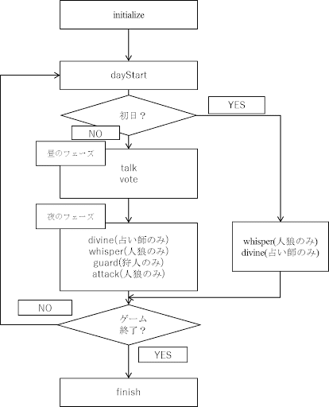

# 第4回人狼知能国際大会<br>プロトコル部門レギュレーション

<div style="text-align: right;">2022/05/XX Ver. 1.2</div>

## 第4回人狼知能国際大会における人狼ゲームのルール

### 村の構成

本大会では，15人および5人のプレイヤーで村を構成します．
各村における役職とその人数は以下の通りです．

| | 村人 | 占い師 | 霊媒師 | 狩人 | 人狼 | 裏切り者 |
|-|-|-|-|-|-|-|
| 15人村 | 8 | 1 | 1 | 1 | 3 | 1 |
| 5人村 | 2 | 1 | 0 | 0 | 1 | 1 |

### 役職

#### 村人側の役職

* 村人：何も能力を持たない村人側のプレイヤーです．
* 霊媒師：前日追放されたプレイヤーが
人間であったか人狼であったかを知ることができます．
追放者のいない0日目，1日目は何の情報も得られません．
* 占い師：1日の終わりに1人のプレイヤーを占い，
そのプレイヤーが人間であるか人狼であるかを知ることができます．
占いは初日にも行うことができます．
占い先が，追放されたプレイヤーである場合は，
占い結果を得ることができません．
したがって，霊媒師がいない場合には，
追放されたプレイヤーが人間であるか人狼であるかを知る術はありません．
なお，占い先決定の前にその日の追放者を知ることができます．
* 狩人：1日の終わりに自分以外の1人のプレイヤーを護衛し，
そのプレイヤーを人狼の襲撃から守ることができます．
護衛先には死者を選ぶこともできますが，
その場合は何も起こりません．
護衛先決定の前にその日の追放者を知ることができます．
<!-- 本大会では，襲撃が無かった場合に手応え
（意図的襲撃ミスなのか，護衛が成功したのか）を得ることはできません． -->

#### 人狼側の役職

* 人狼：1日の終わりに各人狼は人間を1人選択して襲撃投票し，
最も多く襲撃投票されたプレイヤーを襲撃します．
また，人狼だけが聞くことのできる「囁き」で，
村人に隠れて人狼同士会話することができます．
* 裏切り者：村人と同じく能力は何も無い人間ですが，
人狼の勝利を目指して行動します． 
当然ながら裏切り者は「囁き」を使えませんし，
占い師や霊媒師の能力では人間と判定されます．

### 対話の仕様

#### ターン制の導入

対話はターン制となります．
各プレイヤーはターンごとに一回発言することができます（発言しないことも可能）．
ただし，発言の順番はターンごとにランダムに決められ，
各プレイヤーは自分の順番より前の発言しか知ることができません．

発言は1日に10回まで行うことができます．
ただし，SkipとOverは発言に含まれません．
すべてのプレイヤーがOverを発言するか，
全てのプレイヤーがSkipをするターンが3回連続すると，
その日の昼のフェーズは終了します．
また，昼のフェーズは最大20ターンです．
20ターン経過した時点で昼のフェーズは終了します．

#### 初日対話

初日に対話はできません．

#### 人狼の囁き

人狼の囁きは襲撃投票前（追放者決定後）にのみ行うことが可能です．
昼フェーズの対話と同じようにターン制で行われます．
初日は襲撃がありませんが，囁きは可能です．
偽CO等をする際に初日の囁きを使って相談することが可能です．

人狼が一人になると囁きは行われません．
サーバから囁きのリクエスト自体が来なくなる
（Javaの場合whisperメソッド自体が呼ばれなくなる）のでご注意ください．


### 投票と再投票

追放のための投票は昼フェーズの最後に行われます．
投票によって決定した追放者の情報は，
夜フェーズの占い・護衛・襲撃投票に利用することが可能です．

最多得票者が複数となった場合は1回に限り再投票となります．
再投票の前に対話はできません．
再投票でも同点だった場合は再投票での最多得票者からランダムに追放者が決定されます．
再投票では，最多得票者も投票権を持ち，投票者は最多得票者以外にも投票可能です．

襲撃投票でも最多得票者が複数となった場合は1回に限り再投票となります．
再投票の前に囁くことはできません．

## 予選，本戦の方式

### セット

本大会では固定メンバーによる100回のゲームを1セットとし，
これを単位として対戦を行います．
1セットの流れは以下の通りです．

1. 全参加チームから5または15チームをランダムに選択して村を構成する．

1. 村の各チームにランダムに役職を振り分け1ゲームを行う．

1. 2.を100回繰り返す．

なお，各チームのエージェントのインスタンスは1セットごとに破棄され，
セットごとに各チームの番号(AgentIdx)はランダムに割り振られます．
言い換えると，1セットの100ゲームの間は同じインスタンスなのでゲームをまたいだ情報のやり取りが可能で，
さらに番号も固定（指定席）です．

### エージェント更新可能期間と予備対戦（デイリーコンテスト）

参加チームは，エージェント登録から予選開始までの間と，
予選終了から本戦開始までの間，
登録エージェントを更新することができます．
エージェント更新可能期間中，
対象エージェント（予選前はすべてのエージェント，予選後は予選通過エージェント）による
予備対戦（デイリーコンテスト）[^1]が開催されます．
予備対戦では，各チームが少なくとも1セット(100ゲーム)を行い，
エージェントがエラー無く動いたチームのみが次の予備対戦に参加できます．
エラーで失格となったチームは，修正したエージェントを新たに登録すれば，
予備対戦に再び参加することができます．
自チームが参加した予備対戦のゲームログと，
エージェントが標準出力に出力したテキスト（エージェントログ）がダウンロードできます．
<span class="red">
**提出したエージェントがサーバ上で正しく動作するかどうかの確認や
エージェントの改良に予備対戦をご利用ください．**
</span>

[^1]:[http://aiwolf.org/daily15/index-j.html](http://aiwolf.org/daily15/index-j.html)（15人村）,[http://aiwolf.org/daily05/index-j.html](http://aiwolf.org/daily05/index-j.html)（5人村）


### 予選

予選では，参加全チームのセット回数が一定回数以上となるまでセットを繰り返し，
勝率上位15チームを選出します．
なお，15人村のセット数と5人村のセット数は揃え，
順位の有意性を高めるため，セットは時間の許す限り多く行います．

### 本戦

予選で選出された15チームに対し、
ランダムに役職を割り当てながらセットを多数回行い，
勝率によって順位を決定します．
予選同様，15人村のセット数と5人村のセット数は揃えます．


## エージェント提出方法

### 参加登録

本大会に参加を希望される方（チーム）は，
人狼知能大会のウェブサイト
([http://contest.aiwolf.org/](http://contest.aiwolf.org/))にアクセスし，
まずはアカウントを作成してください．
アカウントの作成をもって参加登録となります．

### エージェントの提出
   
参加登録後，
すべての役職を実装したエージェントのファイルを
大会ウェブサイトの「マイページ」より提出（アップロード）して下さい．
提出するファイルは実装に用いるプログラミング言語によって以下のように異なります．

#### Javaエージェント
      
提出可能なファイルはjarファイル一つです．
機械学習などのライブラリなどを利用する場合は
jarファイルの中に含めておいてください．
自動的にクラスパスに追加されます．
         
データファイルなどはjarファイルの中に含めておいて，
読み込むことができます．
たとえば，zipファイル内の/data/hoge.datを読み込みたい場合は，

```java
InputStream is = getClass().getClassLoader().getResourceAsStream("data/hoge.txt");
```

と書くことで，
ファイルへのInputStreamを得ることができます．
         
なお，aiwolf-client.jar, aiwolf-server.jar, aiwolf-common.jar, aiwolf-viewer.jar, jsonic-xxxx.jarを含めていると
クラス名の衝突（コンフリクト）が発生し，
正しく動作しない可能性があるため，お控え下さい．

対戦サーバにおけるJavaのバージョンは17です．
それ以降のバージョンを利用してエージェントを作成した場合，
正常に動作しない可能性があります．

#### C#(.NET)エージェント

今回から自己完結コンソールアプリケーション
（従来のDLLではありません）の提出となります．
ランタイムをlinux-x64に指定して
self-containedでpublishしたディレクトリの内容を
zipファイルに固めたものを提出してください．
zipファイルのルートディレクトリに実行ファイルを配置してください．
ファイル名の制限はありません．
提出時に実行ファイル名を指定していただきます．
実行ファイルは以下のコマンドライン引数を正しく受け付けるように実装してください．

* ゲームサーバのホスト名を指定する -h hostname
* ゲームサーバのポート番号を指定 -p port
* エージェント名を指定する -n name

データファイルなどは埋め込みリソースとしてアセンブリに埋め込んでおけば，
実行時にAssembly.GetManifestResourceStreamメソッドで
Streamを得ることができます．

#### Pythonエージェント  

提出可能なファイルはzipファイルです．
zipファイルのルートディレクトリに起動スクリプトファイルを配置してください
（従来と配置が異なります）．
ファイル名の制限はありません．
提出時に起動スクリプトファイル名を指定していただきます．
起動スクリプトは以下のコマンドライン引数を正しく受け付けるように実装してください．

* ゲームサーバのホスト名を指定する -h hostname
* ゲームサーバのポート番号を指定 -p port
* エージェント名を指定する -n name

### ソースファイルとアルゴリズム概要文書の提出

決勝進出チームには，大会ウェブサイトから提出した実行ファイルの他に，
エージェントのソースファイルおよびアルゴリズムの概要を記述した
文書の提出が義務付けられています．
実行ファイルとソースファイルが同一であるPythonエージェントも例外ではなく，
改めてソースファイルの提出が必要です．
ソースファイルとアルゴリズム概要文書の提出方法は予選の後に連絡します．  
これらを提出しなかったチームは失格となります．

## 禁止事項

本大会では，以下の項目に該当するエージェントを提出したチームは，
原則として予選不戦敗となります（場合によっては個別に連絡を差し上げた上で対処します）．

* 実行中にエラー
* 人狼知能プロトコルに準拠しない（Javaで言うとContentBuilderで生成不可能な）発話文字列を返す
* ファイルへの書き込み
（ファイルの読み込みは，Javaエージェントではjarファイル内のファイル，
C#エージェントではアセンブリに埋め込まれたリソース，
Pythonエージェントではzipファイル内のファイルに限り可）
* ネットワークへの接続（ゲームサーバへの接続は除く）
* スレッドの立ち上げ
* 別プロセスでのプログラムの実行
* サーバからのリクエストに対する応答時間が100ms以上
* 他チームと同一のエージェントでの参加（両チームとも失格，同一性は運営側が判断）

## プレイヤーのプログラム実装について（Java版）

ここではJavaエージェントを例にとって説明します
（C#とPythonの場合も基本的な考え方は同じです）．

第4回人狼知能国際大会では人狼知能プラットフォーム0.6.xの利用を想定しています．
AIWolfCommon.jar内のorg.aiwolf.common.data.Playerインターフェースを
継承したクラスがプレイヤーとしてゲームに参加することができます．

### Playerインターフェースの実装すべきメソッド  

Playerインターフェースを継承したクラスは11個のメソッドを実装する必要があります．
これらのメソッドは以下の4種類に分類されます．

* 情報処理メソッド：initialize, update, dayStart, finish
* 対象指定メソッド：vote, attack, guard, divine
* 会話メソッド：talk, whisper
* 命名メソッド：getName

#### 情報処理メソッド（initialize, update, dayStart, finish）

これらは情報を処理するためのメソッドで，何も戻り値を返す必要がありません． 

* initialize(GameInfo, GameSetting)：ゲーム開始時に一度だけ呼ばれます．
引数として現在のゲーム状態を表すGameInfoと
ゲームの設定（各役職の人数等）を表すGameSettingが与えられます．
* update(GameInfo)：initialize以外の全てのメソッドの前に呼ばれます．
引数としてゲーム内の最新の情報を含んだGameInfoが与えられます．
finish()の前に呼ばれる時のみ，
全プレイヤーの役職情報を含んだGameInfoが与えられます．
* dayStart()：毎日の始めに一度だけ呼ばれます．
* finish()：ゲーム終了時に呼ばれます． 

#### 対象指定メソッド（vote, attack, guard, divine）

対象となるAgentを戻り値として返すメソッドです．
attack, guard, divineは特定の役職の場合のみ呼ばれるメソッドです．

* vote()：その日に投票する対象Agentを返します．
* attack()：人狼のみ呼ばれるメソッドです．
その日に襲撃投票する対象Agentを返します．
* guard()：狩人のみ呼ばれるメソッドです．
その日に護衛する対象Agentを返します．
* divine()：占い師のみ呼ばれるメソッドです．
その日に占う対象Agentを返します．

#### 会話メソッド（talk, whisper）

発言する内容（String型）を返すメソッドです．
whisperは人狼の場合のみ呼ばれます．
本大会で有効な発言内容は
org.aiwolf.client.lib.ContentBuilderで生成できるStringのみです
（詳しくは「5.3 発言可能な内容」を参照）．

* talk()：村全体に対して発言する内容を返します．
* whisper()：人狼のプレイヤーのみ呼ばれるメソッドです．
人狼だけに対して発言する内容を返します．
この発言内容は人狼以外のプレイヤーに公開されることはありません．

#### 命名メソッド（getName）

* getName()：プレイヤーの名前（String型）を返します．
ゲーム実行時のログに名前が反映されます．

### 各メソッドの呼ばれるタイミング
   
getName以外の10個のメソッドは下図のタイミングで呼び出されます．
なお，updateはinitialize以外の全てのメソッドの前に呼び出されますので，
図中では省略されています．



### 発言可能な内容

本大会では，
org.aiwolf.client.lib.ContentBuilderの
サブクラスで生成可能な発言のみで会話を行います．
生成可能な発言は以下の23種類です．

* estimate：□□が△△の役職は○○だと思う．(EstimateContentBuilder)
* comingout：□□が△△の役職を○○と明かす．(ComingoutContentBuilder)
* divination：□□が△△を占う．(DivinationContentBuilder)
* divined：□□が△△を占った結果，○○（人間or人狼）だった．
(DivinedResultContentBuilder)
* identified：□□の霊能行使の結果，△△は○○（人間or人狼）だった．
(IdentContentBuilder)
* guard：□□が△△を護衛する．(GuardCandidateContentBuilder)
* guarded：□□が△△を護衛した．(GuardedAgentContentBuilder)
* vote：□□が△△に投票する．(VoteContentBuilder)
* voted ：□□が△△に投票した．(VotedContentBuilder)
* attack：□□が△△に襲撃投票する．（AttackContentBuilder）
* attacked ：□□が△△を襲撃した．(AttackedContentBuilder)
* agree：□□が発言Tに同意する．(AgreeContentBuilder)
* disagree：□□が発言Tに反対する．(DisagreeContentBuilder)
* request：□□が△△に〜を要請する．(RequestContentBuilder)
* inquire：□□が△△に〜を照会する．(InquiryContentBuilder)
* because：□□が◇◇の理由で〜を主張する．(BecauseContentBuilder)
* and：□□が A, B, … を同時に主張する．(AndContentBuilder) 
* or：□□が A, B, … の少なくとも一つを主張する．( OrContentBuilder)
* xor：□□が A, B のどちらかを主張する．(XorContentBuilder)
* not：□□が〜を否定する．(NotContentBuilder)
* day：□□がx日目に〜であったと主張．(DayContentBuilder)
* over：もう話すことは無い．（全プレイヤーがOVERなら会話フェーズ終了）
(OverContentBuilder)
* skip：様子を見る．（他のプレイヤーが全員OVERでも会話フェーズが終了しない）
(SkipContentBuilder)

### Playerクラスのパッケージについて

Playerクラスはチーム独自の物を作成してください．
人狼知能プラットフォーム付属のクラス
（org.aiwolf.sample.player.SampleRoleAssignPlayerなど）
を直接書き換えることは避けてください．

クラス名の衝突を避けるため，
Playerクラスはチーム固有のパッケージに配置するようにしてください．
一般に，パッケージ名をドメイン名またはメールアドレスの逆順で命名します．
例えば，`gm@aiwolf.org`というメールアドレスをお持ちの方が
MyPlayerというPlayerクラスを作成する場合，
パッケージとしてorg.aiwolf.gmを指定し，

```java
package org.aiwolf.gm;
import org.aiwolf.sample.lib.AbstractRoleAssignPlayer;

public class MyPlayer extends AbstractRoleAssignPlayer {

}
```

という書き方になり，
クラスパスはorg.aiwolf.gm.MyPlayerとなります．

## 他の言語で参加する場合

Java以外の言語はPython，C#(.NET)を想定しています．
これらの言語で参加する場合は，それぞれのライブラリを参照して下さい．
独自のライブラリでもTCP/IP接続ができ，
エージェントが正しく動けば参加することができますので
事前に運営側にご相談([gm@googlegroups.com](gm@googlegroups.com))ください．

なお，対戦サーバのOSはLinuxなので，
その点に注意して，特殊な環境に特化したエージェントでの参加はご遠慮下さい．
サーバ上で動かなかったエージェントは自動的に失格となります．
そのようなことを避けるためにも事前の予備予選への参加を強く推奨します．
また，対戦サーバと同環境のdockerイメージ[^2]を提供しています．
エージェントの検証にお役立てください．

[^2]:[https://github.com/users/aiwolf/packages/container/package/aiwolf](https://github.com/users/aiwolf/packages/container/package/aiwolf)

## 更新

レギュレーションは予告なく変更される可能性があります．
変更された場合はプロジェクトページ
([http://aiwolf.org](http://aiwolf.org))，
開発者メーリングリスト([aiwolfdev@googlegroups.com](aiwolfdev@googlegroups.com))
あるいはTwitterアカウント(@aiwolf_org)で告知いたしますので，
登録あるいはフォローをしておいてください．

更新履歴

* 2022年04月17日 Ver. 1.0
* 2022年04月19日 Ver. 1.1
* 2022年05月XX日 Ver. 1.2
